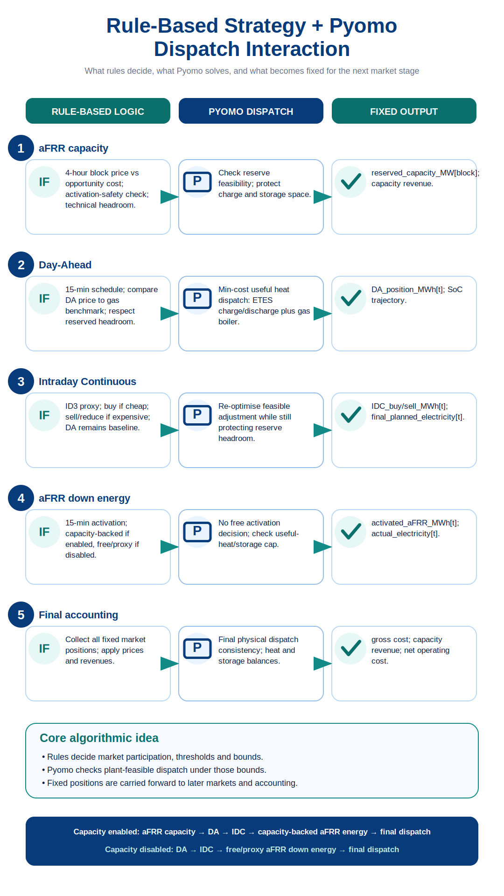
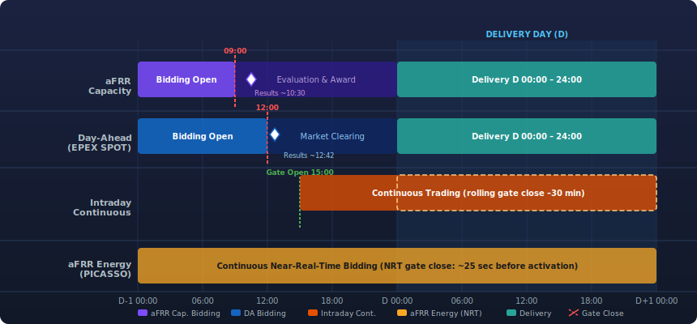

<!--
SPDX-FileCopyrightText: FLEXIMOD Developers

SPDX-License-Identifier: AGPL-3.0-or-later
-->

# Modeling Philosophy And Architecture

FlexIMOD stands for **Flexible Industrial Market-Oriented Dispatch Model**. It is
designed to model industrial energy systems that participate in sequential
electricity and flexibility markets.

The first implemented case is a hybrid ETES + gas boiler steam plant in Germany,
but the architecture is meant to support other industrial processes, technologies,
countries, and market designs.

## Core Philosophy

FlexIMOD separates four questions that are often mixed in monolithic models:

1. Which market stages exist, and in which order are they evaluated?
2. What are the product rules, signal columns and timing conventions of each
   market?
3. Which market actions are attractive or allowed according to an operator
   strategy?
4. Which plant operation is physically feasible and cost-minimal?

The answer to the first question belongs to the case configuration and runner.
The answer to the second question belongs to market classes. The answer to the
third question belongs to strategy classes. The answer to the fourth question
belongs to the plant and technology model.

This gives the project its central modelling principle:

```text
Rule-based market strategy + Pyomo-based plant dispatch and feasibility
```

<p align="center">
  
</p>

The strategy should not hard-code plant physics. The plant model should not
hard-code market rules. The runner coordinates the order in which both are used.

## Sequential Market Logic

Markets are evaluated in the order defined by the selected study case's
`market_sequence` under `cases.<case_name>` in `config.yaml`. They are evaluated
inside each rolling decision window, not one market over the entire simulation
period. The intended market sequence is:

```text
afrr_capacity -> day_ahead -> intraday_continuous -> afrr_energy
```

After these market stages, the model performs final physical dispatch/accounting.
The intended rule is that earlier market decisions become fixed when later
markets are evaluated inside the same decision window.

Examples:

- aFRR down capacity reserves charging headroom before day-ahead and intraday
  decisions;
- intraday continuous may adjust a day-ahead position, but should not overwrite it;
- aFRR energy must use only the remaining ETES charging headroom, or the reserved
  capacity headroom when capacity is enabled.

## Decision Windows And Rolling Simulation

The current market-calendar simulation is deterministic and window-based:

- `dispatch_horizon_hours` defines the market decision window;
- `rolling_step_hours` defines how far the simulation moves forward after each
  decision window;
- all configured market stages are cleared inside the current window;
- only the final enabled market stage in that window carries ETES state of
  charge into the next window.

For example, with:

```yaml
dispatch_horizon_hours: 24
rolling_step_hours: 24
```

the runner makes daily decisions:

```text
day 1: afrr_capacity -> day_ahead -> intraday_continuous -> afrr_energy
day 2: afrr_capacity -> day_ahead -> intraday_continuous -> afrr_energy
...
```

If both values are changed to `48`, the model makes two-day decision windows.
The sequence remains modular: disabled markets are skipped, and the configured
`market_sequence` controls the stage order.

The plant-level Pyomo solves live in `SteamGenerationPlant`. The simulation
runner decides which forecast slice, initial state of charge, fixed market
positions, and reserved headroom are passed to each stage.

## German Market Gate Clock Example

The German case stores market timing in `config.yaml` so the market calendar is
visible to modellers and not hidden in strategy code. The visual timeline below
summarises the example gate times used for the current German electricity market
setup.

<p align="center">
  
</p>

For a daily decision window, the delivery day is called `D`. The runner evaluates
the configured market sequence for that delivery window:

```yaml
market_sequence:
  - afrr_capacity
  - day_ahead
  - intraday_continuous
  - afrr_energy
```

The timing fields describe when each market opens or closes relative to the
delivery window:

| Market stage | German example in config | Algorithmic meaning |
| --- | --- | --- |
| aFRR down capacity | opens `D-7 10:00`, closes `D-1 09:00`, 4-hour product, `EUR/MW/h` price | reserves ETES charging headroom before DA and IDC; creates capacity revenue and capacity-backed aFRR energy limits |
| Day-ahead | closes `D-1 12:00`, 15-minute energy product | creates the fixed DA electricity position for the delivery window |
| Intraday continuous | rolling close `5` minutes before delivery start | adjusts the fixed DA position with IDC buy or sell/reduction volumes |
| aFRR down energy | rolling close `25` minutes before delivery start in the current config, 15-minute validity | adds activated down energy on top of the scheduled DA+IDC position |

The current algorithm uses this clock as follows:

1. Select the next rolling decision window from the simulation index.
2. Treat that window as the delivery period `D`.
3. Read `market_sequence` as the execution order.
4. Read each market's `gate_open`, `gate_close`, product length, product
   resolution and signal mapping from the selected `cases.<case_name>` entry.
5. Run each enabled market stage on the same delivery-window forecast slice.
6. Pass fixed outputs forward: capacity reservation constrains DA and IDC,
   DA becomes the IDC baseline, IDC creates scheduled electricity, and aFRR
   energy creates actual electricity consumption.
7. Commit the accepted rows from the rolling window and carry the final ETES
   state of charge to the next decision window.

`market_sequence` remains the authoritative execution order. Gate times explain
the market-calendar clock, support validation and logging, and make it possible
to adapt the same algorithm to another country by changing configuration rather
than strategy or plant physics.

## Main Package

The canonical Python import package is `flexi_mod`. Model configuration, data
loading, plant components, strategies, ledgers, simulation orchestration, and
visualisation utilities all live under this namespace.

Important modules:

```text
src/flexi_mod/config/case_config.py
src/flexi_mod/data/data_loader.py
src/flexi_mod/markets/base_market.py
src/flexi_mod/markets/day_ahead.py
src/flexi_mod/markets/intraday_continuous.py
src/flexi_mod/markets/afrr_energy.py
src/flexi_mod/plants/technologies.py
src/flexi_mod/plants/steam_generation_plant.py
src/flexi_mod/strategies/base_strategy.py
src/flexi_mod/strategies/hybrid_etes_gas_strategy.py
src/flexi_mod/ledgers/market_ledger.py
src/flexi_mod/ledgers/storage_cost_ledger.py
src/flexi_mod/simulation/simulation_runner.py
src/flexi_mod/visualisation/analytics.py
src/flexi_mod/visualisation/plots.py
```

## Configuration Layer

Each `cases.<case_name>` entry describes modelling assumptions and market setup:

- study-case name, country, time range, and time resolution;
- active strategy name;
- market decision window and rolling step;
- solver choice;
- market sequence;
- market enable flags;
- market timing metadata;
- market product rules;
- mapping from market signals to columns in `forecasts_df.csv`.

`config.yaml` intentionally does not contain output paths, output switches, or
detailed strategy rules. Those belong to the runner and strategy classes.

## Market Layer

Market classes interpret the market design from `config.yaml`. They define what
kind of product is represented, which signals are required, which product
resolution or validity period is configured, and how raw market input columns are
prepared for the strategy.

The current market classes are:

- `DayAheadMarket`, an energy market for the delivery day;
- `IntradayContinuousMarket`, an incremental energy adjustment market after
  day-ahead;
- `AFRRDownEnergyMarket`, an activated down-balancing energy product with
  system-level proxy activation;
- `AFRRUpEnergyMarket`, a documented placeholder for later upward balancing
  energy modelling;
- `AFRRCapacityMarket`, a down-reserve capacity product that generates internal
  4-hour blocks and prepares block prices for pre-DA headroom reservation.

Market classes do not decide whether the plant operator buys, sells or bids.
Those decisions stay in the strategy layer.

## Input Data Layer

Each case input folder contains:

```text
config.yaml
plants.csv
forecasts_df.csv
additional_charges.csv  # optional
```

`plants.csv` defines industrial plants and their connected technologies. Rows
with the same `name` belong to one plant. Different `technology` values define
connected components.

`forecasts_df.csv` contains all time series. For the current day-ahead MVP the
minimum required time-series columns are:

```text
datetime
plant_1_heat_demand
DE_DA_price
natural_gas_price
```

CO2 is currently disabled in the active objective and benchmark. A `co2_price`
column may still exist in input files for later use, but it is not required for
the current MVP.

If the selected `cases.<case_name>` entry sets `additional_charges: true`,
`additional_charges.csv` is loaded as plant-specific electricity consumption
charge adders in `EUR/MWh_el`. These charges are added to DA, IDC, and aFRR
energy prices for strategy decisions, dispatch costs, and stored-heat cost
accounting. They apply only to consumed electricity energy and not to aFRR
capacity reservation revenue.

## Plant And Technology Layer

The plant model follows a reference-style split:

- `technologies.py` defines technology classes, attributes, Pyomo variables,
  parameters, and component-level constraints.
- `steam_generation_plant.py` connects those technologies into one plant-level
  Pyomo model.

For the first case, the plant contains:

- `ThermalStorage`, representing ETES storage;
- `GasBoiler`, representing natural-gas heat supply.

The plant-level model connects both technologies through a heat bus:

```text
storage useful discharge + gas boiler heat = heat demand
```

Electricity consumption is currently equal to ETES electric charging:

```text
electricity consumption = electric charge to storage
```

## Objective Function

The current MVP minimizes:

```text
electricity market cost
+ additional electricity consumption charges
+ gas fuel cost
```

CO2 cost is kept as a zero-valued output column for compatibility, but it is not
included in the active objective for now.

There are no artificial unmet-heat, excess-heat, or heat-dumping variables. If
the plant cannot meet heat demand exactly with connected technologies, or if
fixed market positions create impossible storage operation, Pyomo reports the
case as infeasible.

## Output Layer

The main output files are:

```text
dispatch_results.csv
market_ledger.csv
storage_cost_ledger.csv
summary_indicators.csv
plots/
```

`dispatch_results.csv` contains physical plant operation and costs.

`market_ledger.csv` contains market-facing electricity positions with explicit
energy-economics units: day-ahead procurement, intraday buy/sell adjustments,
scheduled electricity procurement, aFRR energy bid and activation, actual
electricity consumption, and the main thermal operation values.

`storage_cost_ledger.csv` treats ETES as a thermal inventory. It records the
procurement market, electricity price, electricity procured, charged heat,
charging cost, thermal inventory, weighted-average inventory cost, and inventory
shares by procurement market.

`summary_indicators.csv` is calculated from the outputs by the analytics module.

## Visualisation And Analytics Layer

The generic plotting and analytics code lives in:

```text
src/flexi_mod/visualisation/analytics.py
src/flexi_mod/visualisation/plots.py
```

The plotting script reads the selected study case, locates the output folder
using `<case_name>_<strategy_name>`, refreshes analytics, and writes
report-ready figures to:

```text
data/output/<case_name>_<strategy_name>/plots/
```

Plots are designed to handle missing future-market columns gracefully. For
example, if IDC or aFRR columns are absent in a day-ahead-only simulation, the
plotting module warns and skips only those series.
