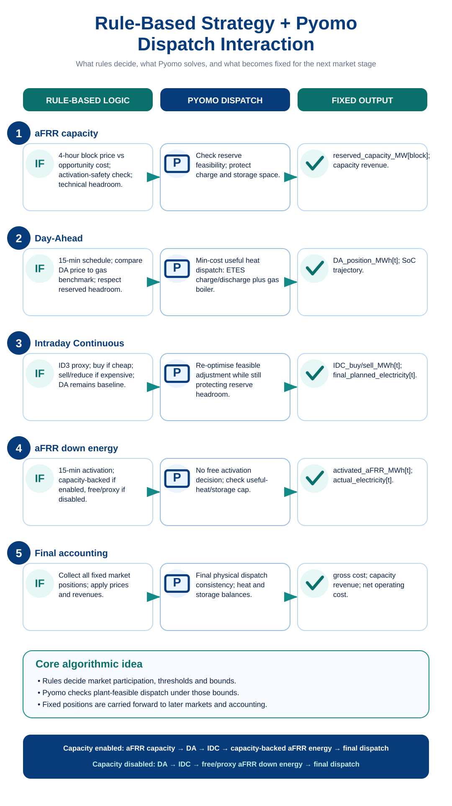
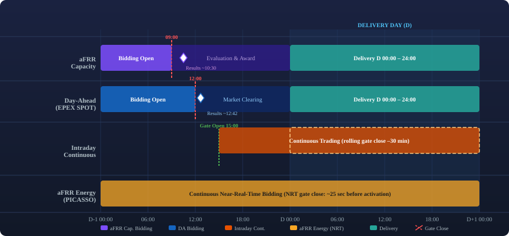

<!--
SPDX-FileCopyrightText: FLEXIMOD Developers

SPDX-License-Identifier: AGPL-3.0-or-later
-->

# Modeling Philosophy And Architecture

FlexIMOD stands for **Flexible Industrial Market-Oriented Dispatch Model**. It is
designed to model industrial energy systems that participate in sequential
electricity and flexibility markets.

The first implemented case is a hybrid ETES + gas boiler steam plant in Germany,
but the architecture is meant to support other industrial processes, technologies,
countries, and market designs.

## Core Philosophy

FlexIMOD separates four questions that are often mixed in monolithic models:

1. Which market stages exist, and in which order are they evaluated?
2. What are the product rules, signal columns and timing conventions of each
   market?
3. Which market actions are attractive or allowed according to an operator
   strategy?
4. Which plant operation is physically feasible and cost-minimal?

The answer to the first question belongs to the case configuration and runner.
The answer to the second question belongs to market classes. The answer to the
third question belongs to strategy classes. The answer to the fourth question
belongs to the plant and technology model.

This gives the project its central modelling principle:

```text
Rule-based market strategy + Pyomo-based plant dispatch and feasibility
```

<p align="center">
  
</p>

The strategy should not hard-code plant physics. The plant model should not
hard-code market rules. The runner coordinates the order in which both are used.

## Sequential Market Logic

Markets are evaluated in the order defined by the selected study case's
`market_sequence` under `cases.<case_name>` in `config.yaml`. They are evaluated
inside each rolling decision window, not one market over the entire simulation
period. The intended market sequence is:

```text
afrr_capacity -> day_ahead -> intraday_continuous -> afrr_energy
```

After these market stages, the model performs final physical dispatch/accounting.
The intended rule is that earlier market decisions become fixed when later
markets are evaluated inside the same decision window.

Examples:

- aFRR down capacity reserves charging headroom before day-ahead and intraday
  decisions;
- intraday continuous may adjust a day-ahead position, but should not overwrite it;
- aFRR energy must use only the remaining ETES charging headroom, or the reserved
  capacity headroom when capacity is enabled.

## Decision Windows And Rolling Simulation

The current market-calendar simulation is deterministic and window-based:

- `dispatch_horizon_hours` defines the market decision window;
- `rolling_step_hours` defines how far the simulation moves forward after each
  decision window;
- all configured market stages are cleared inside the current window;
- only the final enabled market stage in that window carries ETES state of
  charge into the next window.

For example, with:

```yaml
dispatch_horizon_hours: 24
rolling_step_hours: 24
```

the runner makes daily decisions:

```text
day 1: afrr_capacity -> day_ahead -> intraday_continuous -> afrr_energy
day 2: afrr_capacity -> day_ahead -> intraday_continuous -> afrr_energy
...
```

If both values are changed to `48`, the model makes two-day decision windows.
The sequence remains modular: disabled markets are skipped, and the configured
`market_sequence` controls the stage order.

The plant-level Pyomo solves live in `SteamGenerationPlant`. The simulation
runner decides which forecast slice, initial state of charge, fixed market
positions, and reserved headroom are passed to each stage.

## German Market Gate Clock Example

The German case stores market timing in `config.yaml` so the market calendar is
visible to modellers and not hidden in strategy code. The visual timeline below
summarises the example gate times used for the current German electricity market
setup.

<p align="center">
  
</p>

For a daily decision window, the delivery day is called `D`. The runner evaluates
the configured market sequence for that delivery window:

```yaml
market_sequence:
  - afrr_capacity
  - day_ahead
  - intraday_continuous
  - afrr_energy
```

The timing fields describe when each market opens or closes relative to the
delivery window:

| Market stage | German example in config | Algorithmic meaning |
| --- | --- | --- |
| aFRR down capacity | opens `D-7 10:00`, closes `D-1 09:00`, 4-hour product, `EUR/MW/h` price | reserves ETES charging headroom before DA and IDC; creates capacity revenue and capacity-backed aFRR energy limits |
| Day-ahead | closes `D-1 12:00`, 15-minute energy product | creates the fixed DA electricity position for the delivery window |
| Intraday continuous | rolling close `5` minutes before delivery start | adjusts the fixed DA position with IDC buy or sell/reduction volumes |
| aFRR down energy | rolling close `25` minutes before delivery start in the current config, 15-minute validity | adds activated down energy on top of the scheduled DA+IDC position |

The current algorithm uses this clock as follows:

1. Select the next rolling decision window from the simulation index.
2. Treat that window as the delivery period `D`.
3. Read `market_sequence` as the execution order.
4. Read each market's `gate_open`, `gate_close`, product length, product
   resolution and signal mapping from the selected `cases.<case_name>` entry.
5. Run each enabled market stage on the same delivery-window forecast slice.
6. Pass fixed outputs forward: a capacity award constrains DA and IDC,
   DA becomes the IDC baseline, IDC creates scheduled electricity, and aFRR
   energy creates actual electricity consumption.
7. Commit the accepted rows from the rolling window and carry the final ETES
   state of charge to the next decision window.

`market_sequence` remains the authoritative execution order. Gate times explain
the market-calendar clock, support validation and logging, and make it possible
to adapt the same algorithm to another country by changing configuration rather
than strategy or plant physics.

## Main Package

The canonical Python import package is `flexi_mod`. Model configuration, data
loading, plant components, strategies, ledgers, simulation orchestration, and
visualisation utilities all live under this namespace.

The package root contains only package metadata. Every implementation module
belongs to one responsibility-specific subpackage:

- `config/`: case schema and configuration loading;
- `data/`: external input-file loading and normalization;
- `modeling/`: shared Pyomo construction, solved-value, and input-validation
  helpers;
- `plants/`: physical plant and technology equations;
- `markets/` and `strategies/`: market rules and operator decisions;
- `regulations/`: country-specific tariff and settlement rules;
- `outputs/` and `ledgers/`: solved-model result mapping and economic records;
- `simulation/`: orchestration and command-line entry points; and
- `visualisation/`: analytics and the interactive Plotly dashboards.

New modules should be placed by this responsibility, rather than added directly
under `flexi_mod`.

Important modules:

```text
src/flexi_mod/config/case_config.py
src/flexi_mod/data/data_loader.py
src/flexi_mod/markets/base_market.py
src/flexi_mod/markets/day_ahead.py
src/flexi_mod/markets/intraday_continuous.py
src/flexi_mod/markets/afrr_energy.py
src/flexi_mod/plants/technologies.py
src/flexi_mod/modeling/validation.py
src/flexi_mod/modeling/pyomo_utils.py
src/flexi_mod/plants/steam_generation_plant.py
src/flexi_mod/plants/steel_plant.py
src/flexi_mod/plants/cement_plant.py
src/flexi_mod/outputs/result_mappers.py
src/flexi_mod/regulations/grid_fees.py
src/flexi_mod/strategies/base_strategy.py
src/flexi_mod/strategies/hybrid_etes_gas_strategy.py
src/flexi_mod/ledgers/market_ledger.py
src/flexi_mod/ledgers/storage_cost_ledger.py
src/flexi_mod/simulation/simulation_runner.py
src/flexi_mod/visualisation/analytics.py
src/flexi_mod/visualisation/dashboard/
```

## Configuration Layer

Each `cases.<case_name>` entry describes modelling assumptions and market setup:

- study-case name, country, time range, and time resolution;
- active strategy name;
- market decision window and rolling step;
- solver choice;
- market sequence;
- market enable flags;
- market timing metadata;
- market product rules;
- mapping from market signals to columns in `forecasts_df.csv`.

`config.yaml` intentionally does not contain output paths, output switches, or
detailed strategy rules. Those belong to the runner and strategy classes.

## Market Layer

Market classes interpret the market design from `config.yaml`. They define what
kind of product is represented, which signals are required, which product
resolution or validity period is configured, and how raw market input columns are
prepared for the strategy.

The current market classes are:

- `DayAheadMarket`, an energy market for the delivery day;
- `IntradayContinuousMarket`, an incremental energy adjustment market after
  day-ahead;
- `AFRRDownEnergyMarket`, an activated down-balancing energy product with
  system-level proxy activation;
- `AFRRCapacityMarket`, a forward capacity-award product;
- `AFRRUpEnergyMarket`, a documented placeholder for later upward balancing
  energy modelling;

Product-specific position objects live alongside these market classes. The
shared `markets/electricity_settlement.py` module translates a selected
electricity product into common Pyomo position and settlement expressions; it
does not contain any steam, storage, or boiler equations.
Market classes do not decide whether the plant operator buys, sells or bids.
Those decisions stay in the strategy layer.

For every configured stage, the runner passes a typed `MarketStageContext`: the
market rules, forecast slice, plant, earlier market results, and the rolling
state. `MarketStageState` stores those results explicitly: an
`operating_schedule` and a `capacity_award`. For a physical dispatch stage, the
strategy first returns a `MarketStageInstruction`; the plant executes its typed
payload through its own Pyomo interface; then the strategy wraps the solved
values in a `MarketStageResult`. Day-ahead, intraday, and aFRR-energy results
replace the current operating schedule. aFRR-capacity is intentionally
different: it produces a capacity award, which later stages receive through the
capacity-award state. This keeps stage sequencing in the runner, commercial
rules in strategies, and physical feasibility in plants.

These hand-off objects live in `simulation/market_stages.py`, rather than the
market package: they describe orchestration between the runner, strategy, and
plant. `MarketResultKind` remains a market concern because each market declares
whether it creates an operating schedule or a capacity award.

## Input Data Layer

Each case input folder contains:

```text
config.yaml
plants.csv
forecasts_df.csv
additional_charges.csv  # optional
```

`plants.csv` defines industrial plants and their connected technologies. Rows
with the same `name` belong to one plant. Different `technology` values define
connected components.

`DataLoader.load_plant_inputs()` groups those rows into one `PlantInput` per
plant, with plant parameters and named technology components. The plant factory
selects the typed Building, Cement, Steel, or Steam model from `unit_type` and
creates it. This follows ASSUME's intent: the loader prepares unit parameters,
the factory creates the selected unit, and the physical model owns only its
technology/topology validation and Pyomo formulation.

`forecasts_df.csv` contains all time series. For the current day-ahead MVP the
minimum required time-series columns are:

```text
datetime
plant_1_heat_demand
DE_DA_price
natural_gas_price
```

CO2 is currently disabled in the active objective and benchmark. A `co2_price`
column may still exist in input files for later use, but it is not required for
the current MVP.

If the selected `cases.<case_name>` entry sets `additional_charges: true`,
`additional_charges.csv` is interpreted by the network-tariff regulation selected
from `case.country` (`src/flexi_mod/regulations/grid_fees.py`). The regulation is the single
seam between national network rules and the engine, exposing a small
country-agnostic interface:

- a **marginal per-MWh charge** added to DA, IDC, and aFRR energy prices for
  strategy decisions, dispatch costs, and stored-heat cost accounting;
- a **high-load-window block mask** that disables grid charging during DSO
  high-load windows (atypical grid use); and
- an **ex-post settlement** producing the authoritative annual network bill
  (tiered grid energy and capacity charges, special network use, levies) written
  to `grid_fee_summary.csv`.

For Germany the regulation implements full-load-hour tiers, the special network
use A/B split, and §19(2) StromNEV atypical grid use (capacity billed on the
high-load-window peak). These charges apply only to consumed electricity, not to
aFRR capacity-award revenue. Adding a country is one `GridFeeRegulation`
subclass plus one registry entry.

## Plant And Technology Layer

The plant model follows a reference-style split:

- `technologies.py` defines technology classes, attributes, Pyomo variables,
  parameters, and component-level constraints.
- `modeling/validation.py` provides the shared mechanics for component-row
  context, forecast-column checks, numeric profiles, profile ranges, and
  time-indexed Pyomo parameters.
- `steam_generation_plant.py` connects those technologies into one plant-level
  Pyomo model.

Plant and technology modules retain rules that depend on their physical
meaning: supported topologies, fuel modes, component limits, and market-stage
semantics. This is the same separation used by ASSUME's units: shared mechanics
are reusable, while a component validates the inputs only it can interpret.

For the first case, the plant contains:

- `ThermalStorage`, representing ETES storage;
- `GasBoiler`, representing natural-gas heat supply.

The plant-level model connects both technologies through a heat bus:

```text
storage useful discharge + gas boiler heat = heat demand
```

Electricity consumption is currently equal to ETES electric charging:

```text
electricity consumption = electric charge to storage
```

For an electricity market stage, the strategy supplies the commercial position
(price gates, position limits, bid and activation limits) as an
`ElectricityMarketRequest` inside the generic `MarketStageInstruction`.
`SteamGenerationPlant` accepts that request through
`solve_market_instruction()`, then uses its physical model to check feasibility
and find the least-cost operation. A future plant family can introduce another
typed market request without changing the runner's stage sequence. Strategies
do not own physical equations; markets do not own operator rules.

## Objective Function

The current MVP minimizes:

```text
electricity market cost
+ additional electricity consumption charges
+ gas fuel cost
```

CO2 cost is kept as a zero-valued output column for compatibility, but it is not
included in the active objective for now.

There are no artificial unmet-heat, excess-heat, or heat-dumping variables. If
the plant cannot meet heat demand exactly with connected technologies, or if
fixed market positions create impossible storage operation, Pyomo reports the
case as infeasible.

## Output Layer

`outputs/result_mappers.py` is the synchronous output boundary.  A mapper reads
the solved Pyomo model for a supported plant type and returns the stable
dispatch-result table used by ledgers, analytics, the dashboards, and file output.  The
plant module owns the physical model; the mapper owns table assembly.  The
simulation runner still owns when and where result tables are persisted.

The main output files are:

```text
dispatch_results.csv
market_ledger.csv
storage_cost_ledger.csv
summary_indicators.csv
dashboard.html
```

`dispatch_results.csv` contains physical plant operation and costs.

`market_ledger.csv` contains market-facing electricity positions with explicit
energy-economics units: day-ahead procurement, intraday buy/sell adjustments,
scheduled electricity procurement, aFRR energy bid and activation, actual
electricity consumption, and the main thermal operation values.

`storage_cost_ledger.csv` treats ETES as a thermal inventory. It records the
procurement market, electricity price, electricity procured, charged heat,
charging cost, thermal inventory, weighted-average inventory cost, and inventory
shares by procurement market.

`summary_indicators.csv` is calculated from the outputs by the analytics module.

## Visualisation And Analytics Layer

`visualisation/analytics.py` calculates the summary indicators and loads result tables
(plain `.csv` or zstd-compressed `.csv.zst`). The interactive dashboards live in:

```text
src/flexi_mod/visualisation/dashboard/
|-- data.py         load a case folder, detect the plant family, aggregate and resample
|-- charts.py       Plotly figure builders (one function per chart, no secondary axes)
|-- sections.py     tabs, KPI tiles and chart/table blocks per plant family
|-- theme.py        validated palette, fixed entity colours, chart template, page CSS
|-- static_html.py  self-contained dashboard.html (no server)
|-- dash_app.py     live Dash app (fleximod-dashboard)
`-- comparison.py   ranking, trade-off and table across many cases
```

Both front ends render the same `Tab`/`Block` objects from `sections.py`, so a chart added
once appears in the static file and in the Dash app. The runner calls
`write_case_dashboard()` after saving results; a failed dashboard produces a warning and never
discards the simulation.

The plant family is detected from the dispatch columns (`heat_demand_MWh` steam,
`building_demand_MWh` building, `clinker_output_t` cement, `steel_output_t` steel). Charts
return `None` when the columns they need are absent, for example IDC or aFRR series in a
day-ahead-only run, and are skipped. To add a chart, write a builder in `charts.py`,
register it in `BUILDERS`, and list it under the relevant family in `sections.py`.

See [dashboard.md](dashboard.md) for how to use the dashboards.

Colours are assigned to entities (day-ahead, intraday, aFRR, gas, storage, ...) in a fixed
order so an entity keeps its colour on every chart. Dark mode uses its own selected steps of
the same hues rather than an inversion.
