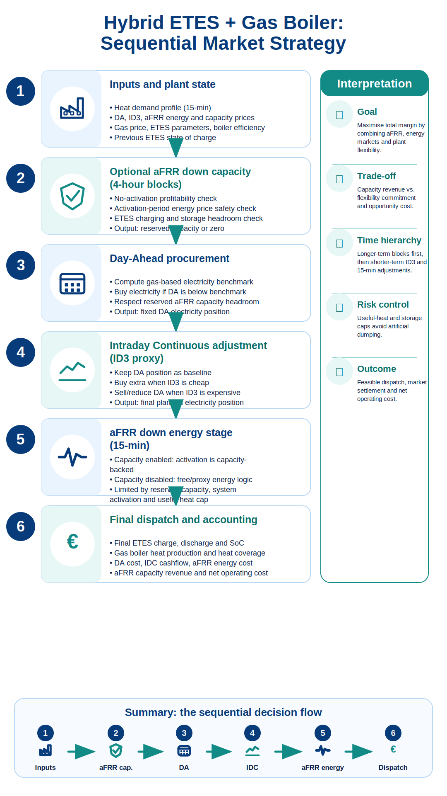

<!--
SPDX-FileCopyrightText: FLEXIMOD Developers

SPDX-License-Identifier: AGPL-3.0-or-later
-->

# Strategy Documentation

This document describes how FlexIMOD strategies are intended to work and
documents the first implemented strategy.

## Strategy Role

A strategy represents market-facing decision logic. It decides which market
actions are economically attractive or allowed, but it should not duplicate the
plant physics.

In FlexIMOD, the intended split is:

```text
markets: product rules, timing, configured signal preparation
strategy: operator decisions, eligibility, benchmarks, bid rules
plant model: feasible dispatch, heat balance, storage balance, costs
runner: sequencing, input/output coordination
```

The runner applies these strategy methods inside each configured decision
window. For example, with a 24-hour decision window the sequence is:

```text
day 1: decide_afrr_capacity -> decide_day_ahead -> decide_intraday_continuous -> decide_afrr_energy
day 2: decide_afrr_capacity -> decide_day_ahead -> decide_intraday_continuous -> decide_afrr_energy
...
```

If a market is disabled, its strategy method is skipped and the downstream
positions default to zero where this is physically meaningful.

The current base strategy interface is defined in:

```text
src/flexi_mod/strategies/base_strategy.py
```

It exposes stage-level methods:

```text
decide_day_ahead(...)
decide_intraday_continuous(...)
decide_afrr_energy(...)
decide_afrr_capacity(...)
```

`decide_afrr_capacity`, `decide_day_ahead`, `decide_intraday_continuous`, and
the first aFRR down energy implementation are available. aFRR down capacity is
evaluated before day-ahead and reserves charging headroom that later market
stages must respect.

## First Implemented Strategy

The first implemented strategy is:

```text
HybridETESGasStrategy
```

It lives in:

```text
src/flexi_mod/strategies/hybrid_etes_gas_strategy.py
```

It is designed for the first case study:

```text
hybrid ETES + gas boiler steam plant
Germany
day-ahead market with optional intraday continuous and aFRR down energy stages
15-minute dispatch resolution
```

<p align="center">
  
</p>

## Day-Ahead Strategy Logic

The strategy is a price-taking day-ahead procurement strategy for ETES charging.

The idea is:

1. Calculate the cost of producing one MWh of useful heat with the gas boiler.
2. Calculate the cost of producing one MWh of useful heat through electric
   charging and later storage discharge.
3. Allow ETES charging only when electric heat is cheaper than gas heat.
4. Let the Pyomo plant model decide the feasible amount of charging, discharging,
   gas heat, and state of charge.

The strategy does not directly choose the exact charging volume. It creates a
time-dependent gate:

```text
charge_allowed[t] = True or False
```

The plant model then enforces:

```text
ETES charge[t] <= ETES max charge[t] * charge_allowed[t]
```

So if the strategy says charging is not allowed, the Pyomo model cannot buy
day-ahead electricity for ETES charging in that time step.

## Gas-Based Heat Benchmark

For the current MVP, CO2 is disabled. The gas benchmark is therefore:

```text
gas_based_heat_cost =
    natural_gas_price / gas_boiler_efficiency
```

Example:

```text
natural_gas_price = 50 EUR/MWh_fuel
gas_boiler_efficiency = 0.90

gas_based_heat_cost = 50 / 0.90 = 55.56 EUR/MWh_th
```

This benchmark is stored in the dispatch output as:

```text
gas_based_heat_benchmark_EUR_per_MWh_th
```

## Electric Heat Cost

The ETES route loses energy during charging and discharging. Therefore, the
effective electric heat cost is calculated as:

```text
electric_heat_cost =
    delivered_day_ahead_price
    / (ETES charge efficiency * ETES discharge efficiency)
```

If charge efficiency is `0.92` and discharge efficiency is `0.92`, then one MWh
of electricity produces:

```text
0.92 * 0.92 = 0.8464 MWh_th
```

So a delivered day-ahead electricity price of `40 EUR/MWh_el` corresponds to:

```text
40 / 0.8464 = 47.26 EUR/MWh_th
```

The delivered electricity price is the market energy price plus optional
industrial electricity consumption charges:

```text
delivered_price = market_price + additional_electricity_charges
```

Additional charges are loaded from `additional_charges.csv` only when the
selected `cases.<case_name>` entry sets `additional_charges: true`. They apply
to consumed electricity energy in DA, IDC, and aFRR energy stages. They do not
apply to aFRR capacity reservation or capacity revenue.

## Charging Rule

The charging rule is:

```text
electric_heat_cost <= gas_based_heat_cost - safety_margin
```

The current safety margin is:

```text
0.0 EUR/MWh
```

So the current rule is simply:

```text
charge ETES only when electric heat is cheaper than gas heat
```

The safety margin is currently embedded in the strategy code:

```text
ELECTRICITY_PRICE_SAFETY_MARGIN_EUR_PER_MWH = 0.0
```

Later, this can be made configurable if we want to test more conservative or
more aggressive bidding behaviour.

## Day-Ahead Position

For the MVP, the day-ahead electricity position is the optimized ETES electricity
consumption:

```text
DA_position_MWh = electricity_consumption_MWh
```

When IDC is disabled, all electricity used for ETES charging is assigned to the
day-ahead market. When IDC is enabled, the DA position remains fixed and the
final ETES charging position is adjusted through IDC buy or sell/reduction
volumes.

## Intraday Continuous Strategy Logic

The first IDC implementation is an index-based adjustment model. It uses the
configured intraday price signal, for example an ID3 column in a German case,
through the intraday continuous market class and the configured price signal.
In `config.yaml`, that signal lives under:

```text
markets -> intraday_continuous -> signals -> price
```

IDC is not modelled as an order book. There are no repeated trading loops,
liquidity limits, bid depth assumptions, or individual transactions. The IDC
volume signal may exist in the input data, but it is optional and unused in this
first implementation.

The day-ahead result is fixed before IDC is evaluated. IDC can only adjust the
fixed DA position:

```text
final_planned_electricity_MWh =
    DA_position_MWh + IDC_buy_MWh - IDC_sell_MWh
```

For the current hybrid ETES + gas plant, this final planned electricity is the
ETES charging electricity:

```text
etes_charge_MWh = final_planned_electricity_MWh
```

This mapping is plant-specific and will need to be generalized for future
industrial plants with several electric processes.

## IDC Benchmark And Rules

The gas benchmark is converted to an electricity-side ETES benchmark:

```text
electricity_trading_benchmark =
    gas_based_heat_cost
    * ETES charge efficiency
    * ETES discharge efficiency
```

The current IDC margin is embedded in the strategy code:

```text
IDC_MARGIN_EUR_PER_MWH = 5.0
```

The rules are:

```text
if delivered_IDC_price < electricity_trading_benchmark - margin:
    allow IDC buy

if delivered_IDC_price > electricity_trading_benchmark + margin:
    allow IDC sell/reduction

otherwise:
    no IDC action
```

The configured IDC action switch is applied after these price rules:

```text
markets -> intraday_continuous -> allowed_actions -> buy
markets -> intraday_continuous -> allowed_actions -> sell
```

If `buy` is false, IDC buy bounds are zero even when the IDC price is cheap. If
`sell` is false, IDC sell/reduction bounds are zero even when the IDC price is
expensive. Setting both to false is an observe-only mode: IDC prices are loaded
and reported, but no intraday trade is created.

The strategy creates upper bounds. Pyomo decides the feasible volume:

```text
IDC_buy_upper_bound =
    max(0, ETES max charge per timestep - DA_position_MWh)

IDC_sell_upper_bound =
    DA_position_MWh
```

If individual IDC price values are missing, the strategy issues a warning and
sets both IDC buy and sell bounds to zero for those timesteps. Missing prices
are not silently filled for trading logic.

## Negative aFRR Down Energy Strategy Logic

The first aFRR energy implementation uses direction-specific down columns:

```text
markets -> afrr_energy -> signals -> price
markets -> afrr_energy -> signals -> system_activation
```

The input quantity is interpreted as a system-level/proxy activation magnitude
for aFRR down, not plant-specific activation. Positive quantities are used
directly. Negative quantities are converted to absolute magnitude and flagged in
the data-quality summary. Missing prices always block bidding, even if
activation quantity is zero. Price values of zero are valid.

The strategy calculates feasible bid potential before Pyomo. The bid potential
uses:

```text
charge-power headroom after DA + IDC
storage-capacity headroom
minimum bid eligibility in MW
```

The 1 MW minimum bid rule applies to bid potential, not realised activation.
Actual proxy activation is calculated before the plant solve:

```text
afrr_energy_activated_MWh =
    min(afrr_energy_bid_upper_bound_MWh,
        afrr_system_activation_MWh)
```

The aFRR down price rule uses an explicit benchmark bid price. The benchmark is
the electricity-side ETES value of replacing gas heat:

```text
afrr_energy_bid_price_EUR_per_MWh =
    electricity_trading_benchmark_EUR_per_MWh_el
    + AFRR_ENERGY_BID_MARGIN_EUR_PER_MWH
```

The current margin is embedded in the strategy code and set to zero:

```text
AFRR_ENERGY_BID_MARGIN_EUR_PER_MWH = 0.0
```

The market-side pay-as-cleared spread is reported as:

```text
afrr_energy_market_spread =
    afrr_energy_bid_price - afrr_energy_down_price
```

The plant only places free aFRR down energy bids when the deal is profitable
after industrial consumption charges:

```text
afrr_energy_down_price + additional_electricity_charge
    <= afrr_energy_bid_price
```

So the market settlement stays:

```text
afrr_energy_cost_EUR =
    afrr_energy_activated_MWh * afrr_energy_down_price
```

If the aFRR energy price is negative, this settlement becomes a credit. The
net plant value after charges is reported separately from this settlement.

Pyomo receives the activated volume as a fixed parameter. It does not decide TSO
activation. For the current hybrid ETES + gas plant:

```text
actual_electricity_consumption_MWh =
    final_planned_electricity_MWh + afrr_energy_activated_MWh

etes_charge_MWh =
    actual_electricity_consumption_MWh
```

This ETES mapping is plant-specific and must be generalized for future
industrial plants with multiple electric processes.

## What Pyomo Decides

After the strategy computes the benchmark and charging gate, the plant model
decides the feasible dispatch by minimizing:

```text
electricity market cost
+ additional electricity consumption charges
+ gas fuel cost
```

The plant model decides:

- ETES charging;
- ETES discharging;
- ETES state of charge;
- gas boiler heat output;
- electricity consumption.

The strategy only decides when charging is economically allowed. The plant model
decides how much charging is useful and feasible.

## aFRR Down Capacity Strategy Logic

When enabled, aFRR down capacity is evaluated before day-ahead. The strategy
uses 4-hour capacity blocks prepared by the market class and applies a
conservative rule:

```text
reserve capacity only if:
    capacity revenue covers estimated opportunity cost
    possible activation energy is economically safe versus the gas benchmark
    ETES charge-power and storage-capacity headroom are sufficient
```

Capacity reservation itself does not add energy to storage. It only reserves
charging headroom and earns capacity revenue. If aFRR energy is also enabled,
later aFRR down activation first uses the capacity-backed energy bid. The
strategy can now also place optional free aFRR energy bids above the reserved
capacity if the additional bid volume is profitable after charges and physically
feasible. If aFRR capacity is enabled but aFRR energy is disabled, the runner
logs this clearly: capacity revenue can be modelled, but activation energy is
not modelled.

## Current Simplifications

The current DA + IDC + aFRR down strategy is deliberately simple:

- the plant is treated as a price taker;
- there is no explicit multi-step bid curve;
- there is no market clearing uncertainty;
- IDC is an index-based adjustment, not an order-book model;
- aFRR down activation is proxy/scenario activation, not plant-specific TSO
  activation;
- day-ahead positions are fixed before IDC adjustments;
- DA and IDC positions are fixed before aFRR down activation;
- CO2 cost is disabled for the active MVP objective and benchmark;
- day-ahead, IDC, and aFRR down prices are treated as deterministic input data.

These simplifications are acceptable for the first MVP because the objective is
to test the plant physics, ledgers, and output workflow before adding more
realistic market mechanisms.

## Planned Strategy Extensions

The next strategy extensions should improve market realism around the existing
stages:

1. Strict bid increments and bid granularity.
2. Bid acceptance probability or merit-order award modelling.
3. Forecast-based or stochastic price expectations.

The key rule for all future stages:

```text
later markets must respect earlier fixed positions
```

For example:

- IDC may buy additional electricity when intraday prices are attractive;
- IDC may sell or reduce a day-ahead position only if heat can still be supplied;
- negative aFRR energy may increase electricity consumption only if charging
  headroom remains;
- aFRR capacity reserves headroom before day-ahead and intraday dispatch when it
  is enabled.

## Strategy Design Principles

New strategies should follow these principles:

- use market signal column names from `config.yaml` when they are market-specific;
- keep general strategy constants in the strategy class or a dedicated strategy
  configuration object;
- do not hard-code plant names;
- do not duplicate Pyomo plant constraints inside the strategy;
- pass eligibility signals and economic signals to the plant model;
- keep disabled market stages safe and explicit;
- record market decisions through ledgers.
